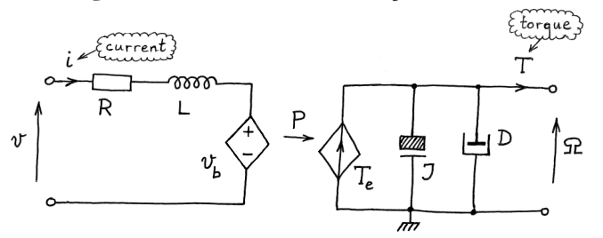

# Circuit Basis

Speaker: Yixiao Qian

---

## Basic Components of the Circuit

- **Components**: (1) **Resistor (R)** $V = IR$; (2) **Inductor (L)** $V = L \dot{I}$; (3) **Capacitor (C)** $I = C\dot{V}$ (voltage difference is $V$)
- **Physical Quantities**: **Voltage (v)**, **Current (i)**

---

## The DC Motor

- **How it works**: 

---

## The DC Motor

- **Electric Circuit (left)**: $v_b$ is back electromotive force.
- **Newton's Second Law**: $\sum \tau = I \cdot \alpha$ where $\sum \tau$ is torque, $I$ is moment of inertia, $\alpha = \frac{\mathrm{d}\Omega}{\mathrm{d}t}$ is angular acceleration.
- **Mechanical Circuit (right)**: Electromagnetic Torque $T_e$; Moment of Inertia $J$; Viscous Friction Coefficient $D$; Load Torque $T$.

