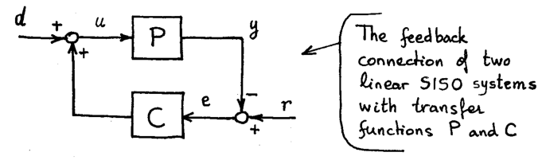
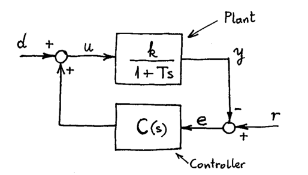
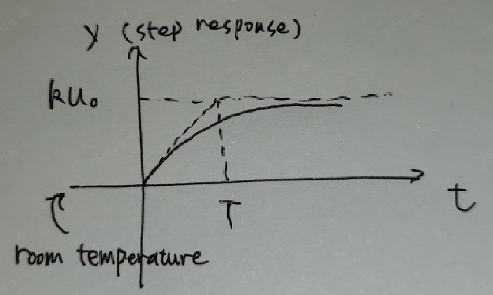
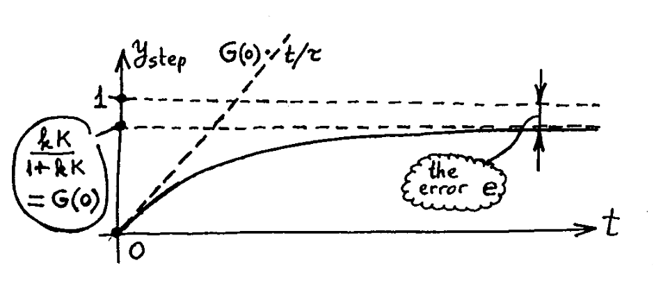
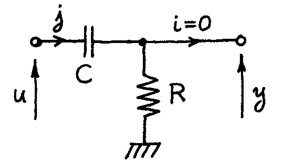
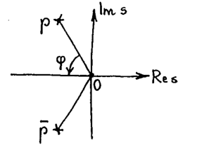
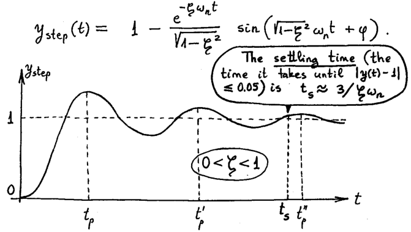
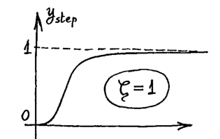
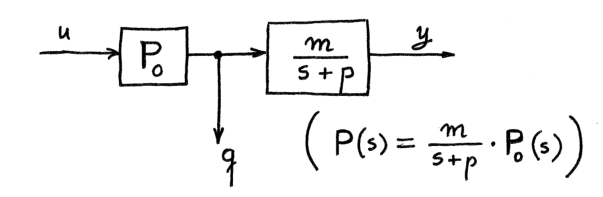
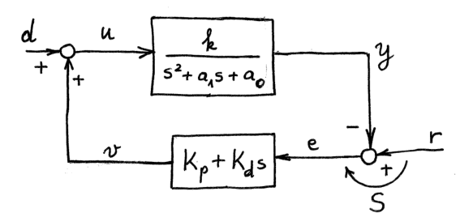

# Introduction to Control System

Speaker: Yixiao Qian

---

# Standard Feedback Connection

---

## Standard Feedback Connection

- $d(t)$ is disturbance, $r(t)$ is reference, $y(t)$ is output of the plant, $e(t)$ is tracking error.
- **Input and Output**: $x = [d, r]$, $y = [u,e]$. (The output can actually be any, you choose.)

$d(t),r(t),y(t),e(t)$ are time-signals. $P(s)$ and $C(s)$ are transfer functions of P and C. 

- **Transfer Func**: $
G(s) =
\begin{bmatrix}
  1 & -C\\
  P & 1
\end{bmatrix}^{-1}
 =
 \begin{bmatrix}
   (1+CP)^{-1} & C(1+PC)^{-1}\\
   -P(1+CP)^{-1} & (1+PC)^{-1}
 \end{bmatrix}$. $G(0)$ is *DC gain*.

It is not hard to see that$\begin{bmatrix}
  \hat{d} \\ \hat{r}
\end{bmatrix} =
\begin{bmatrix}
  1 & -C\\
  P & 1
\end{bmatrix}
\begin{bmatrix}
  \hat{u}\\ \hat{e}
\end{bmatrix}$. Then $G(s) = \begin{bmatrix}
  1 & -C\\
  P & 1
\end{bmatrix}^{-1}$.

---

## Stability of Standard Feedback Connection

- **Loop Gain**: The relation between $e$ and $y$, that is $P(s)C(s)$.
- **Sensitivity**: $e=r-y$ and $y=PCe$, then $S := \frac{e}{r} = (1+PC)^{-1}$.
- **Stability Condition**: Iff (1) $S$ is stable; (2) No unstable pole-zero cancellation in $PC$.
- **Stable Pole-Zero Cancallation**: The pole/zero cancelled is in $\mathbb{C}_-$ (not include $\operatorname{Re}z = 0$)

There is a stable pole-zero cancellation:
$$ P(s) = \frac{s}{(s+1)(s-2)}, \quad C(s) = \frac{5(s+1)}{s^2 + 1}.  $$

---

# Control of a First Order System

---

## Concept of a First Order System

- **Plant**: The transfer function is $\frac{k}{1+Ts}$, where $T$ is time constant, $k$ is gain.
- **Proportional Control**: The transfer function $C(s) = K$ (Constant Gain).

---

## First Order System without Controller

In this example, we ignore the controller and only consider the plant (a water heater).
- **Input**: Power $u$, which is a step function meaning ON ($u \equiv u_0$ after turning on).
- **Output**: Temperature $y$, which is step response.
- **What is $y$ when $t \rightarrow \infty$**: The limit $y \rightarrow P(0)u_0 = ku_0$ , where $P(0)$ is the *DC gain*.

(1) $\hat{y}(s) = P(s) \hat{u}(s)$, where $\displaystyle \hat{u}(s) = \int_0^{+\infty} e^{-st} u_0\mathrm{d} t = \frac{u_0}{s}$.
(2) By final value theorem, $\lim \limits _{t \rightarrow \infty}y(t) = \lim \limits _{s \rightarrow 0}s \hat{y}(s) = P(0)u_0$.

---

## First Order System with Constant Controller

- **Stability**: The first order system is stable.

(1) Sensitivity: $S(s) = (1 + \frac{kK}{1+Ts})^{-1} = \frac{1+Ts}{1 + kK + Ts}$. (Stable due to analytic and bounded)
(2) Zero-Pole Cancallation: $P$ and $C$ do not cancel anything.

- **Step Response**: $\hat{y} = (1 - S)\hat{r} = \frac{kK}{1 + kK + Ts}\hat{r}$. The DC gain is $\frac{kK}{1+kK}$. So $y \rightarrow \frac{kK}{1+kK}r$.

The exact expression is $y(t) = \frac{kK}{1+kK}(1 - e^{- \frac{t}{\tau}})$ where $\tau = \frac{T}{1+kK}$. So the tangent line intersects upper bound at $t = \tau$.

---

## Larger $K$ or Smaller $K$?

- **Larger $K$**: The error $r - y$ is smaller; The temperature goes up more quickly.
- **Smaller $K$**: $v(0) = Kr$ is smaller, which means the power requirement is smaller.

---

## First Order System with Non-Constant Controller

- **Aim**: We want the error to be small under certain frequency.
- **How**: $\hat{e}(i\omega) = S(i\omega)\hat{r}(i\omega)$, then we want $S(i\omega) = \frac{1}{1+PC}$ to be smaller (make $C$ larger).

---

# Eliminating the Steady-State Error

---

## Steady-State Error

- **Steady-State Error**: The error $e$ converges to $e_{ss}$ if $d \equiv d_{ss}$ and $r \equiv r_{ss}$ stay unchanged.
- **Zero Limit**: If $S(0) = 0$, then $e_{ss} \rightarrow 0$ for any $r_{ss}$ and $d_{ss}$, .

We have $\hat{e} = S\hat{r} - PS\hat{d}$, and by final value theorem:
$$ e_{ss} = \lim \limits _{s \rightarrow 0} s\hat{e}(s) = \lim \limits _{s \rightarrow 0}S(s)s\hat{r}(s) - \lim \limits _{s \rightarrow 0}P(s)S(s)s\hat{d}(s) = S(0)r_{ss} - P(0)S(0)d_{ss}. $$

- **Conditions**: (1) $e_{ss} = 0$ then $C$ has a pole $s = 0$; (2) If $P(0) = 0$, then $e_{ss} \neq 0$.

(1) $S = \frac{1}{1+PC}$, $S(0) = 0$ then $C(0) = \infty$. (2) $P(0) = 0$ and $C(0) = \infty$, then there is a pole-zero cancellation at $s = 0$.

---

## Example Circuit

- **Components**: Input $u$ (valtage), output $y$ (valtage). Transfer function $P(s) = \frac{RCs}{1+RCs}$.
- **Stability**: $P(0) = 0$, so the system is not stable.

Physical Explaination: To obtain $e_{ss} = 0$, we need $\lim \limits _{t \rightarrow \infty}y(t) = r$. And $u$ has to go infinity.

---

# PI Controller

---

## PI Controller

- **PI Controller**: $C(s) = K_p + \frac{K_i}{s}$, here $K_p$ can $K_i$ can be adjusted.
- **Water Heater Example**: For $P(s) = \frac{k}{1+Ts}$ and $C(s) = \frac{K_i}{s}$. Then $S(s) = \frac{Ts^2 + s}{Ts^2 + s + kK_i}$, the numerator is stable, no pole-zero cancellation, so it is stable. $S(0) = 0$, so $e_{ss} \rightarrow 0$.
- **Transfer Function from $r$ to $y$**: $G(s) = 1 - S(s) = \frac{kK_i}{Ts^2 + s + kK_i}$, or wirtten
$$ G(s) = \frac{\omega_n^2}{s^2 + 2\zeta \omega_ns + \omega_n^2}, \quad \omega_n^2 = \frac{kK_i}{T}, \zeta = \frac{1}{2 \sqrt{kK_iT}}. $$

The poles are symmetric with respect to the real axis, satisfying $\omega_n = |p|$ and $\zeta = \cos \varphi$.

---

## Stability of PI Controller

- **Step Response**: Consider $y_{\text{step}}$ for $G(s)$, when $\zeta \leq 1$. In this example, $y_{\text{step}} \rightarrow 1$.
- **Overshoot**: The error between the peak $1 + \sigma$ and the limit $1$, $\sigma = e^{- \frac{\zeta \pi}{\sqrt{1 - \zeta^2}}}$.

---

## Eliminating the Overshoot

For $\zeta = 1$, the step response $y_{\text{step}} = 1 - (1 + \omega_n t)e^{-\omega_n t}$. There is no overshoot, but the response become slower (rises slower at the beginning).

---

# PR Controller

---

## PR Controller

Here we consider the $r(t)$ and $d(t)$ of the form $r(t) = R \cos(\omega_0 t + \psi)$.

- **PR Controller**: $C(s) = K_p + \frac{K_rs}{s^2 + \omega_0^2}$.

If there is another frequency, then add an additional term of $\frac{\tilde{K}_r s}{s^2 + \omega_1^2}$.

- **Property**: If $K_p > 0$, $K_r > 0$, then $\operatorname{Re} C(s) \geq 0$ for $s \in \mathbb{C}_+$ (Positive Transfer Function).

---

# PD Controller

---

## PD Controller

- **PD Controller**: $C(s) = K_p + K_ds$. It is not proper, we use $C(s) = K_p + \frac{K_ds}{1 + Ts}$ sometimes.

Since $s = i\omega$, $Ts \sim 0$ when $\omega < < \frac{1}{T}$.

- **Aim**: Sometimes we fail to use PI to stablize the system, but PD can somehow do it.
- **Special Case**: If $P$ can be factorized as follows, then $\dot{y} + py = mq$ (by Laplace).

---

## Example: Apply PD Controller to Stablize Systems

- **Transfer Function from $r$ to $y$**: $G(s) = \frac{kK_ds + kK_p}{s^2+(a_1+kK_d)s+(a_0+kK_p)}$.

---

