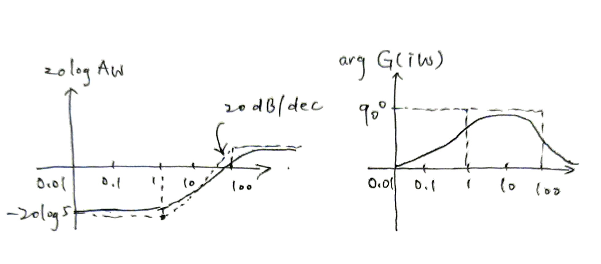

# Linear Systems

Speaker: Yixiao Qian

---

# Concept and Stability of Linear Systems

---

## Linear Time-Invariant System

- **Linear Time-Invariant System (LTI)**: State $x(t) \in \mathbb{C}^n$, Input $u(t) \in \mathbb{C}^m$, Output $y(t) \in \mathbb{C}^p$.
$$
\Sigma: \quad \dot{x}(t) = A x(t) + Bu(t), \quad y(t) = Cx(t) + Du(t).
$$
- **Linear**: $(u_1(t), x_1(0)) \rightarrow (x_1(t), y_1(t))$, $(u_2(t), x_2(0)) \rightarrow (x_2(t), y_2(t))$
$$ (u_1(t) + u_2(t), x_1(0) + x_2(0)) \rightarrow (x_1(t)+x_2(t), y_1(t)+y_2(t)). $$
- **Time-Invariant**: The output of $(u(t), x(0))$ is same as that of $(u(t + \tau), x(\tau))$ after $t = \tau$.
- **SISO and MISO**: SISO means $m = p = 1$, MISO means $m > 1$, $p = 1$.
- **Order**: The dimension of the state $n$ is the order of the system.
- **Stability**: If $e^{At} \rightarrow 0$. The equivalent condition is $\operatorname{Re}(\lambda_k) < 0$.

Consider $A = H^{-1}JH$, then $e^{At} = H^{-1}e^{Jt}H$. Expand $e^{Jt}$, and each entry is like $e^{\lambda_i t}$.

---

## Transfer Function of Linear System

- **Transfer Function**: $G(s) = \frac{\hat{y}(s)}{\hat{u}(s)}$, where $\hat{u}(s)$ and $\hat{y}(s)$ are Laplace transformation of $u,y$.
- **Transfer Function of Linear System**: $G(s) = C(sI - A)^{-1} B + D$, 

(1) Apply Laplace transformation to $\dot{x} = Ax + Bu$, then $s \hat{x}(s) - x(0) = A\hat{x}(s) + B\hat{u}(s)$.
(2) $\hat{x}(s) = (s I - A)^{-1}x(0) + (sI - A)^{-1}B\hat{u}(s)$.
(3) Substituting into $\hat{y}(s) = C\hat{x}(s) + D\hat{u}(s)$, take $x(0) = 0$: $\hat{y}(s) = [C(sI - A)^{-1}B + D]\hat{u}(s)$.

- **Rational**: Each entry in $G$ is of the form $\frac{p(x)}{g(x)}$, $\operatorname{deg}(p) = n-1$ and $\operatorname{deg}(g) = n$.

(1) $(sI - A)^{-1} = \frac{1}{|sI - A|}(s I - A)^\ast$, $|sI - A|$ is the characteristic polynomial, its degree is $n$.
(2) Entries of $(sI - A)^\ast$ are either $n - 1$-order (diagonal) or $n - 2$-order (not diagonal).

- **(Strictly) Proper**: $G(\infty) = D$ (finite). If $D = 0$, then $G(\infty) = 0$, and it is strictly proper.
- **Poles**: Poles of $G$ are subset of $\sigma(A)$ (eigenvalues of $A$).

---

## Stability of Transfer Function

- **Stability**: Analytic and bounded on $\mathbb{C}_+$. (Rational function: proper, all poles are in $\mathbb{C}_-$)
- **Minimal System**: No systems of lower order has the same transfer function. A linear system is minimal iff its poles are exactly $\sigma(A)$.
- **Relation with Stable System**: Stable system implies stable transfer function. (Vice versa when system is minimal)

(1) $G(s)$ is proper; (2) Poles of $G(s)$ are eigenvalues of $A$, which are in $\mathbb{C}_-$.

- Determine if $\frac{(s^2 - 1)e^{-7s}}{(s^2 + 2s + 5)(-s-3)}$ is stable. (Yes, $e^{-7s}$ is stable, $\frac{s^2 - 1}{(s^2 + 2s + 5)(-s-3)}$ is also stable)
- $A =
\begin{bmatrix}
  -3 & 0 \\ 5 & 2
\end{bmatrix}
$, $B =
\begin{bmatrix}
  3 \\ 11
\end{bmatrix}
$, $C =
\begin{bmatrix}
  8 & 0
\end{bmatrix}
$, $D = 0$. Find minimal system, transfer function, stability.

---

## Routh Test

- **Idea**: Determine if the system is stable without computing the eigenvalues.
- **Polynomial Stability**: If roots are in $\mathbb{C}_-$. If its coefficients are real, then they are positive. (and vice versa if $n = 2$)
- **Routh Test**: The polynomial is stable iff all entries of the first column are positive.

$$
\begin{bmatrix}
  1 & a_{n-2} & a_{n-4} & a_{n-6} & \cdots \\
  a_{n-1} & a_{n-3} & a_{n-5} & a_{n-7} & \cdots
\end{bmatrix}
$$

- **Calculation of $b$**: If $a_n$ is over, then substitute it with $0$.
- Derive the formula for $p(s) = s^3 + a_2s^2 + a_1 s + a_0$.

$b_1 = \frac{-1}{a_2}(a_0 - a_1a_2)$ and $c_1 = \frac{-1}{b_1}(-a_0b_1) = a_0$. So it is stable 

- If $A$ is unstable and all entries in first column are non-zero, then the number of unstable eigenvalues of $A$ is equal to the number of sign changes in the first column.

---

## Energy of Linear Systems

- **Energy**: $\displaystyle \|u\|^2 = \int_0^{\infty} |u(t)|^2 \mathrm{d} t$.
- If the input $u$ has finite energy, $G$ is stable, then $y$ has finite energy.

---

# Bode Plot and Nyquist Plot

---

## Bode Plot

- **Gain and Phase Shift**: Given $G(s)$, *gain* is $A_{\omega} = |G(i\omega)|$, *phase shift* is $\varphi_{\omega} = \operatorname{arg} G(i\omega)$.
- **Decibel (dB)**: Just an unit, does not contain any physical meaning.
- **Bode Plot**: The $y$-axis is $20 \log_{10} A_{\omega}$ or $\varphi_{\omega}$, the $x$-axis is $\omega$ decibel.

1. Factorize $G(s) = F_1(s) \cdots F_N(s)$, where $F_i(0)$ has gain $1$
2. $\log |G(i\omega)| = \log |F_1(i\omega)| + \cdots + \log |F_N(i\omega)|$, $\operatorname{arg} G(i\omega) = \operatorname{arg} F_1(i\omega) + \cdots + \operatorname{arg} F_N(i\omega)$.

---

## An Example of Bode Plot

- Example: $G(s) = 5 \cdot \frac{s+1}{s+100} = \frac{1}{20} \cdot \frac{1 + s}{1 + \frac{s}{100}}$.

(1) Numerator: When $|s| < 1$, $|s+1| \sim 1$; when $|s| > 1$, $|s+1| \sim |s|$.
(2) Denomerator: When $|s| < 100$, $|1 + \frac{s}{100}| \sim 1$; when $|s| > 100$, $|1+\frac{s}{100}| \sim \frac{s}{100}$.
(3) $A_{\omega}(s) \approx \frac{1}{20}$ when $|s| < 1$; $A_{\omega}(s) \approx \frac{1}{20}s$ when $|s| \in (1,100)$; $A_{\omega}(s) \approx 5$ when $|s| > 100$.

- Example: $G(s) = \frac{1}{s}$. $|G(i\omega)| = |\frac{1}{\omega}|$, the line intersects the $x$-axis at $x = 1$.

---

## Nyquist Plot

