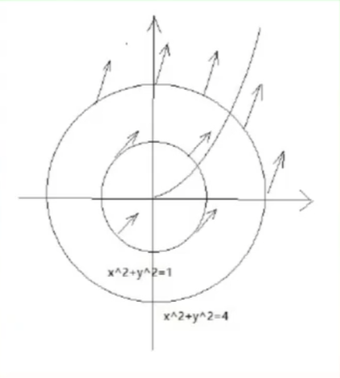

# Existence and Uniqueness of Solutions

Speaker: Yixiao Qian

---

## Table of Contents

---

# Euler's Polygonal Method

---

## Geometric Meaning of ODE

- **Geometric Meaning**: $y^{\prime} = f(x,y)$, then the tangent direction at $(x, y)$ is $f(x,y)$.
- Draw the direction/slope field of $y^{\prime} = x^2 + y^2$.

---

## Euler's Polygonal Method

Here we consider the IVP
$$ y^{\prime} = f(x,y), \quad y(x_0) = y_0. $$

- **Euler's Forward Method**: $x_k = x_{k-1} + h$, and $y_{k+1} = y_k + f(x_k, y_k)h$.
- **Equicontinuous**: $\forall \epsilon > 0$, $\exists \delta > 0$, $\forall x_1, x_2$, $|x_1 - x_2| < \delta$, $|f_n(x_1) - f_n(x_2)| < \epsilon$ for all $n > 0$.
- **Uniform Boundedness**: $\exists M > 0$, $\forall x \in I$, $|f_n(x)| \leq M$ for all $n > 0$.
- **Ascoli-Arzela Theorem**: $\{f_n\}$ are equicontinuous and uniformly bounded, then there exist $f_{n_j} \rightrightarrows f$, $f$ is continuous.
- **Properties of Euler Polygonal Curve**: If $f$ is bounded, then Euler polygonal curves are equicontinuous and uniformly bounded.

Since $f_{n_j}$ converges rather than $f_n$, then the Euler sequence may have multiple limits.

---

## Peano's Existence Theorem

- **Peano Existence Theorem**: $f$ is continous in $R: \{(x,y): |x-x_0| < a, |y-y_0| < b\}$. Then IVP has solution when $|x-x_0| \leq \alpha$, where $\alpha = \min \{a, \frac{b}{M}\}$, $M = \max_R |f|$.

Why $\frac{b}{M}$? Assume $y^{\prime} \equiv M$, then the solution reaches the upper bound of $R$ when $\alpha = \frac{b}{M}$.

---

# Picard Existence and Uniqueness Theorem

---

## Existence: Picard Sequences

- **Integral Equation**: $y(x)$ follows $\displaystyle \frac{\mathrm{d} y}{\mathrm{d} x} = f(x,y)$ with $y(x_0) = y_0$ iff
$$ y(x) = y_0 + \int_{x_0}^x f(t,y(t))\mathrm{d} t $$
- **Picard Sequence**: $\varphi_0(x) = y_0$ and $\displaystyle \varphi_n(x) = y_0 + \int_{x_0}^x f(t, \varphi_{n-1}(t))\mathrm{d} t$ for $n \geq 1$.
- **Lipschitz Continuous**: $f(x,y)$ is *Lipschitz continuous with respect to $y$* if
$$ |f(x,y_1) - f(x,y_2)| \leq L |y_1 - y_2|, \quad \forall (x,y_1),(x,y_2) \in R.$$

---

## Uniqueness: Gronwall Inequality

- **Gronwall Inequality**: $\alpha(x) \geq 0$, $u(x) \geq 0$ are continuous on $[x_0, x_1]$, $C \geq 0$, $K \geq 0$. If $\displaystyle u(x) \leq C + \int_{x_0}^x [\alpha(s)u(s) + K]\mathrm{d} s$, then
$$ u(x) \leq [C + K(x-x_0)]e^{\int_{x_0}^x \alpha(s)\mathrm{d} s}. $$

In condition, $u(x)$ are on both sides, but the result represents $u(x)$ by known conditions.

- **Osgood Condition**: $f$ is continuous in $R$, $|f(x,y_1) - f(x,y_2)| \leq F(|y_1 - y_2|)$, where $F(r) > 0$ when $r > 0$ and continuous, ${\displaystyle \int_0^{r_1}\frac{\mathrm{d} r}{F(r)}} = \infty$ for some $r_1$. Then IVP has unique solution.

---

## Existence and Uniqueness Theorem

If $f(x,y)$ is Lipschitz continuous with respect to $y$ in $R = [x_0-a,x_0+a] \times [y_0-b,y_0+b]$. Then there exists a unique solution $y = \varphi(x)$ such that

$$ \frac{\mathrm{d} y}{\mathrm{d} x} = f(x,y), \quad x \in (x_0-h, x_0+h), \quad \varphi(x_0) = y_0, $$

where $h = \min \left( a, \frac{b}{M} \right)$, $M = \max_{(x,y) \in R} |f(x,y)|$.

Muller counterexample is non-Lipschitz continuous but has unique solution.

---

## Practice on Existence and Uniqueness Theorem

Assume $\frac{\mathrm{d} y}{\mathrm{d} x} = 2x + \sqrt{\max(0, y)}$ with $y(x_0) = y_0$.
(1) Write the corresponding integration equation;
(2) Write the Picard sequence;
(3) Determine if the solution exists and is unique.

(1) The integration equation is ${\displaystyle y(x) = y_0 + \int_{x_0}^x \left[2t + \sqrt{\max(0, y(t))} \right]\mathrm{d} t}$.
(2) The Picard sequence is $y_0(x) = y_0$, $\displaystyle y_{n+1}(x) = y_0 + \int_{x_0}^x \left( 2t + \sqrt{\max (0, y_n(t))} \right)\mathrm{d} t$
(3) $F(x,y) = 2x + \sqrt{\max(0, y)}$. When $y > 0$, $F = 2x + \sqrt{y}$, when $y \leq 0$, $F = 2x$. Consider $y > 0$, $F^{\prime}_y = \frac{1}{2\sqrt{y}}$, when $y \rightarrow 0$, $F^{\prime}_y \rightarrow \infty$, then it does not satisfy Lipschitz condition.

---

# Extension of Solution

---

## Extension of Solution

- **Forward/Backward Solution**: Forward solution is the solution to the right, backward to the left.
- **Maximal Interval**: $(x_0, +\infty)$ if $y \not \rightarrow \infty$. $(x_0, x_1)$ if $\lim \limits _{x \rightarrow x_1}y(x) = \infty$.
- **Extension of Solution**: $G \subset \mathbb{R}^2$ is open, $f$ is continuous in $G$. Then the solution of $y^{\prime} = f(x,y)$ can extend from $(x_0, y_0) \in G$ to $\partial G$.
- **Unique Extension of Solution**: $f$ is continous on $R$, and $|f(x,y_1) - f(x,y_2)| \leq L|y_1 - y_2|$ holds for all $x \in [a, b]$ (Uniformly Lip Continuous). Then the maximal interval is $(a, b)$.
- Find the maximal interval of $y^{\prime} = \sin \frac{y}{x}$.

For any $A > 0$, $f$ is uniformly Lipschwtz continuous on $(A, +\infty)$. Then the solution exists on $(0, +\infty)$.

